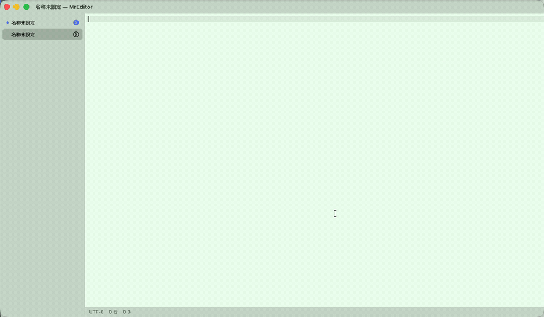
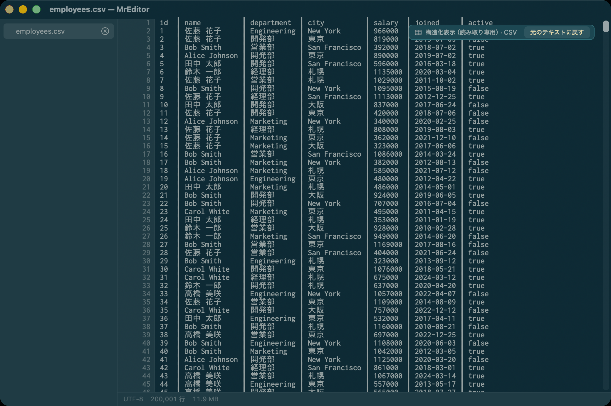
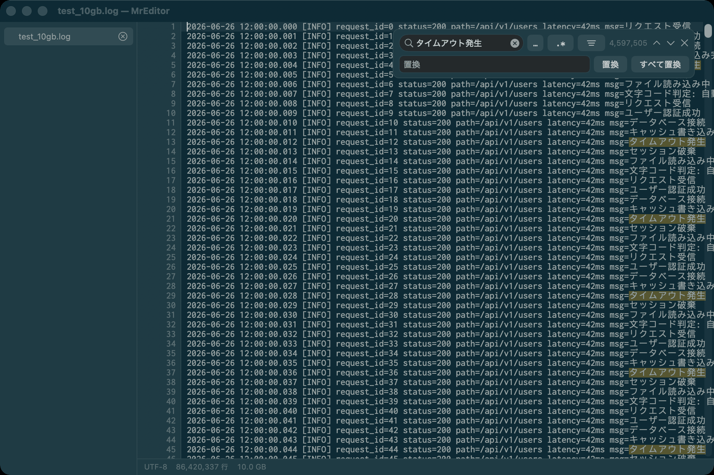

# MrEditor

[English](README.md) | **日本語**

**10GB のテキストを、落ちずに開いて編集する Mac ネイティブのビューア／エディタ。**

10GB のログ ―― **86,420,337 行** ―― を開いても、表示が始まるまで **約 80ms**。ファイルは
マップするだけでコピーしないので、10GB を開いた状態でも `vmmap` が報告する dirty は
**0 バイト**です。末尾の行へのジャンプは **0.1ms**。**v0.4 からは編集・保存**にも対応
（サイズを問わず・atomic 書き込み）。

> はじめは高速な**読み取り専用**ビューアでした（全文検索・フィルタ表示 / live grep・`tail -f`）。
> **v0.4 で名前どおりに** ―― その場で編集して保存できます。



*一発撮り（カットなし・等倍）の冒頭 10 秒です。10.00GB が開き、索引が背後で走っている最中にそのままスクロールしています。ステータスバーに注目してください —— 索引が完了する（9.1 秒）まで行数は概算で、完了すると正確な **86,420,337 行**に収束します。その間も表示は一度も止まらず、読む・探す・編集するができます。[全編 27 秒（カットなし。⌘L で末尾行へ跳ぶところまで）はこちら。](docs/media/mreditor-10gb.mp4)*

<p align="center">
  
  
</p>

## なぜ作るのか

macOS でテキストを表示する定番は `NSTextView` ですが、内部の `NSTextStorage` に
**全文を保持**します。10GB を渡すと破綻する。そこで MrEditor は巨大ログビューア
（klogg / glogg / lnav）の定石を採ります。

- ファイルは **mmap**。全文をメモリに乗せない。
- **疎な行インデックス**を持つ（2,000 行ごとに行番号とバイトオフセットを 1 組 → このファイルで 670KB、1 億行でも約 800KB）。
- **見えている行だけ** Core Text で描く。スクロールは「行」単位の自前 `NSScroller` で表現し、
  16 億ポイントの巨大ビュー（float 精度の崖）を作らない。

設計の詳細は [docs/ARCHITECTURE_v0.1.md](docs/ARCHITECTURE_v0.1.md) を参照してください。

## 機能（1.2）

**表示**
- 任意サイズの巨大テキストを開ける（10GB で検証済み）。表示開始はほぼ一瞬。
- 文字コードの自動判定：**UTF-8 / Shift-JIS / EUC-JP**（実ファイルで確認済み）。
- 行単位の自前スクローラとキーボード操作（矢印・ページ・Home/End）。
- **行番号ジャンプ（⌘L）** と **フォント拡大縮小（⌘+ / ⌘- / ⌘0）** — 起動をまたいで保持。
- **末尾追従（`tail -f`・⌥⌘F）** — ファイルが伸びると自動スクロール。索引は増分拡張。
- 可視範囲のコピー（⌘C）。ステータスバー：文字コード・行数・サイズ・索引進捗。

**編集（v0.4 で追加）**
- **サイズを問わず編集・保存** — 小さいファイルは `NSTextView` に読み込み、巨大ファイルは
  mmap 上の **piece table** で編集。10GB でも入力に追従します。
- **atomic 保存** — 一時ファイルに書いてから入れ替え。元ファイルが中途半端に壊れることがありません。
- **保存エンコードの指定** — **UTF-8 / Shift-JIS / EUC-JP** へ変換。改行はファイルの EOL（LF / CRLF）へ正規化。
- 新規（⌘N）・保存（⌘S）・別名で保存（⌘⇧S）・保存済みへ戻す。

**ワークスペース**
- **複数ファイルを同時に開いて**、**サイドバー**のリストで切り替え。
- **サイドバーから閉じる** — 各行に閉じる（×）ボタン。**未保存のドキュメントは色分け**表示。
- **セッション復元（v0.7 で追加）** — 起動すると前回のサイドバーが並び直ります（順序と
  アクティブなタブも復元。消えたファイルは読み飛ばし）。**未保存の新規ドキュメントも本文ごと復元**
  するため、終了時に新規タブの保存を促されることはありません（保存済みファイルの未保存編集は
  従来どおり確認します）。
- **最近使った項目**（ファイル ▸ 最近使った項目を開く）。
- ウィンドウへのファイルのドラッグ＆ドロップで開く。
- **Finder 統合（v0.8 で追加）** — Finder の「このアプリケーションで開く」に MrEditor が並びます
  （`.log` / `.txt` / `.csv` / `.json` など。既定のアプリは奪いません）。
- **印刷・PDF 出力（v0.8 で追加）** — ファイル ▸ プリント…（⌘P）。プリントダイアログの
  「PDF ▸ PDF として保存」で PDF になります。巨大ファイルは数百万ページになるため無効です。
- **アップデート確認（v0.8 で追加）** — 新しい版が出たら知らせます（起動時・1日1回まで）。
  置き換えはせず、ダウンロードページを開くだけ。環境設定 ▸ 一般 でオフにできます。

**カスタマイズ（v0.5 で追加）**
- **フォント** — 任意の等幅ファミリとサイズを選択（環境設定 ▸ 表示）。起動をまたいで保持。
- **表示** — タブ幅（2/4/8）・行間・現在行ハイライト・カーソル形状（バー/ブロック/アンダーライン）・折り返し。
- **配色テーマ** — System（ライト/ダーク自動）・Solarized Dark / Light・Monokai・完全カスタム。本文だけでなく
  **周辺 UI（サイドバー・ガター・ステータス・タイトルバー）** まで連動。

**検索**（⌘F）— mmap をストリーム走査。ファイルを読み込まない
- 可視行の即時ハイライト＋背景の全文走査で正確な件数（一致行は上限100万）。
- **複数語 AND**（スペース区切り）・**正規表現**（`.*` トグル）・**大文字小文字の区別**トグル。
- 次/前へ移動して各一致行へジャンプ。
- **フィルタ表示 / live grep** — 一致行だけ表示（実行番号は保持）。

**比較 / diff（v1.1 で追加）** — 表示 ▸ 比較（diff）
- 入口は 4 つ: **2 つのファイルを選ぶ**（⇧⌘D）・**開いているドキュメント同士**（未保存の本文もそのまま）・**クリップボードと比較**・**URL と比較**（https。リンクを貼れば取得して、いま開いているものと差分）。
- 左右に並べ、追加・削除・変更を色で。**変更行は行内の文字差分まで**出す（`status=200` → `500` の 1 文字が分かる）。
- **⇧⌘] / ⇧⌘[** で次/前の差分へ。**スクロールバーに差分の位置**が出るので、数百万行のどこが違うか一目で分かる。
- 列の中で選択して **⌘C** でコピー（相手側にしか無い行は混ぜない）。
- **マージ（v1.2 で追加）** — 差分の横の **→ をクリック**すると、**左の内容がその場で右へ入ります**（もう一度で取り消し。⌥→ / ⌥← でも可）。
  矢印の向きどおり、**変わるのは右**。**表示 ▸ 比較（diff）▸ マージ結果を別名で保存…** で、その右側を書き出します。
  **元の 2 つのファイルには触りません。** 何も取り込まなければ、右がそのまま出ます。
- 比較には 1 行あたり 16 バイトの索引が要る（閲覧と違い、実際にメモリを使う）。載らないサイズは
  **理由を出して断る**（黙って落ちない）。実測: 1GB × 2（871 万行）で 5.4 秒・1.7GB。

**構造化表示（v0.6 で追加）** — 読み取り専用・表示 ▸ 構造化表示 で切替
- **CSV / TSV** を等幅カラムに桁揃え、**NDJSON** はキーごとに列へ投影。
- 列幅はサンプルから固定するので、**数百万行でも一瞬で整形**・スクロールでもブレない。
  **東アジア文字幅対応**で全角の日本語列もピタリ揃う。
- 表示だけの変換でファイルは変更しない（保存しても元の CSV/JSON のまま）。
  有効中は **「元のテキストに戻す」** ボタン付きの帯を表示。

UI は **日本語と英語にローカライズ**（システム言語に追従）。

## インストール

[Releases](../../releases) から `MrEditor-<バージョン>.dmg` をダウンロードして開き、
**MrEditor** を Applications にドラッグします。

**Apple Silicon / Intel の両方で動きます**（universal ビルド）。

**v0.9 から Apple Developer ID で署名し、Apple の公証（notarization）を通しています。**
右クリックも `xattr` も不要です。ダブルクリックするだけで開きます。

あるいは下記のソースからのビルドでも動きます。

## ビルドと実行

macOS 13 以降と Swift ツールチェーン（Xcode 15+）が必要です。

```sh
swift build
sh scripts/make_app.sh debug          # バイナリを MrEditor.app に包む
open .build/MrEditor.app --args "/path/to/big.log"
```

テストデータの生成（`testdata/` は git 管理外）：

```sh
python3 scripts/gen_testdata.py --encoding-set --out-dir testdata/   # UTF-8 / SJIS / EUC サンプル
python3 scripts/gen_testdata.py --size 10G --jp --out testdata/test_10gb.log
```

配布用ディスクイメージ（`.build/MrEditor-1.3.dmg`）の作成:

```sh
sh scripts/make_dmg.sh
```

## 性能（2026-07-15 実測 / 10.00GB・86,420,337 行・日本語 UTF-8）

配布と同じ 1.3 ビルド（`swift build -c release --arch arm64 --arch x86_64`）、Apple Silicon で計測。

| 指標 | 結果 |
|---|---|
| 表示開始まで（first paint） | 55〜90ms |
| 全索引の構築（背景・表示はブロックしない） | 9.3〜10.2 秒 |
| 末尾行へのシーク | 0.1ms |
| ファイル本体のページ | resident 4〜6GB（実行ごとに変動）・**dirty 0 バイト** |
| アプリの実メモリ | 約 130MB（何も開いていなくてもほぼ同じ） |

下の 2 行は必ずセットで読んでください。**開いた 10GB のコストは 0 です**。マップするだけで
コピーせず、`vmmap` がそのファイルに帰属させる dirty は 0 バイト —— resident なページは
ファイルバックドで、OS がいつでも捨てられます。アプリ側の約 130MB はウィンドウの描画バッファと、
10GB をマップするためのカーネルのページテーブルであって、ファイルを開いていてもいなくてもほとんど
変わらず、あなたのログではありません。索引構築中に `ps` の RSS が数 GB に見えるのも同じ理由で、
同じくらい意味がありません。

手元で再現するには:

```sh
MREDITOR_TIMING=1 .build/MrEditor.app/Contents/MacOS/MrEditor testdata/test_10gb.log
# → first paint: 73.9 ms
# → index complete: 9.79 s (86420337 lines)

vmmap $(pgrep -x MrEditor) | grep test_10gb.log     # → 10.0G  5.6G  0K  (vsize resident dirty; resident は変動・dirty は 0 のまま)
```

## ロードマップ

- **v0.1 — ビューア** ✅
- **v0.2 — 検索・複数語AND・正規表現・フィルタ表示（live grep）・`tail -f`・コピー** ✅
- **v0.3 — 複数ドキュメント＋サイドバー・行番号ジャンプ・フォント拡大縮小・最近使った項目・大文字小文字区別検索** ✅
- **v0.4 — 編集・保存（サイズ不問）・atomic 書き込み・エンコード変換・EOL 処理・新規/保存/別名保存/復帰** ✅
- **v0.5 — カスタマイズ: フォント選択・表示設定・配色テーマ（本文＋UI）・サイドバー閉じる/未保存の色分け** ✅
- **v0.6 — 構造化表示: CSV/TSV カラム整形・NDJSON フィールド投影（読み取り専用・サイズ不問）** ✅
- **v0.7 — セッション復元（未保存の新規も本文ごと）・About パネル修正** ✅
- **v0.8 — Finder 統合・印刷/PDF 出力・アップデート確認・新アイコン・universal ビルド。および配布物の重大な修正（下記）** ✅
- **v0.9 — Apple Developer ID で署名し、公証（notarization）を通した。右クリック不要でダブルクリックで開ける** ✅
- **1.0 — 巨大ファイルを開いて編集できる Mac エディタとして完成。署名・公証済みで、ダブルクリックで開く** ✅
- **1.0.1 — ファイルを開いて起動すると未保存の新規ドキュメントが消えるバグを修正（データ消失）** ✅
- **1.0.2 — 未保存の本文を draft ファイルとして守る（打鍵のたびに保存。クラッシュ・強制終了でも失わない）** ✅
- **1.0.3 — 日本語入力ONのとき、行ジャンプ（⌘L）が黙って失敗するバグを修正** ✅
- **1.1 — 比較（diff）: 2 つのファイル・開いているドキュメント同士・クリップボードと。並べて、変わった文字まで色で出す** ✅
- **1.1.1 — 「2 つのファイルを比較」が、1 つ目 → 2 つ目 と順に訊くようになった。以前は ⌘クリックで 2 つ同時に選ばないと、黙って何も起きなかった** ✅
- **1.2 — マージ: 差分の横の矢印をクリックして取り込み、結果を別名で保存する。元の 2 ファイルには触らない** ✅
- **1.2.1 — マージの向きを矢印どおりに直した（→ は左の内容を右へ）。押した瞬間に右の中身が変わる。以前は印を覚えるだけで画面が変わらず、「マージされない」ように見えた** ✅
- **1.3 — URL と比較（https）: リンクを貼れば、取得した中身を、いま開いているドキュメントと差分する。入口は「2 ファイル・開いているドキュメント同士・クリップボード」に続く 4 つ目** ✅（このリリース）
- **以降** — シンタックス/ログのハイライト、その他の分析ツール

> **⚠️ v0.7 以前の dmg は、ダウンロードした Mac で起動しません。**
> `.app` バンドルに署名を施していなかったため、署名の封が矛盾し、macOS が
> quarantine の付いたアプリを検証してプロセスを終了させていました
> （「予期しない理由で終了しました」）。**v0.8 で修正済みです。**
> あわせて **Apple Silicon / Intel の universal ビルド**になりました（従来は arm64 専用）。
>
> **v0.8 は起動しますが、初回だけ右クリック →「開く」が必要です**（ad-hoc 署名のため）。
> **v0.9 以降は署名・公証済みで、その操作も不要です。**

## まだ「作らない」もの

シンタックス/ログのハイライトと、より深い分析ツール。編集・保存は **v0.4 で対応しました** ――
piece table 設計により、10GB でも「速く・低メモリで開く」を犠牲にせず編集できます。

## コントリビュート

バグ修正・性能・表示/編集/検索の改善・翻訳は歓迎します ―― [CONTRIBUTING.md](CONTRIBUTING.md) を参照。
コアは「巨大ファイル向けの高速ビューア／エディタ」。より重い自動化・分析ツールは射程外です
（オープンコア。MIT なので fork は自由）。

## ライセンス

[MIT](LICENSE) © 2026 TABATA Hitoshi
