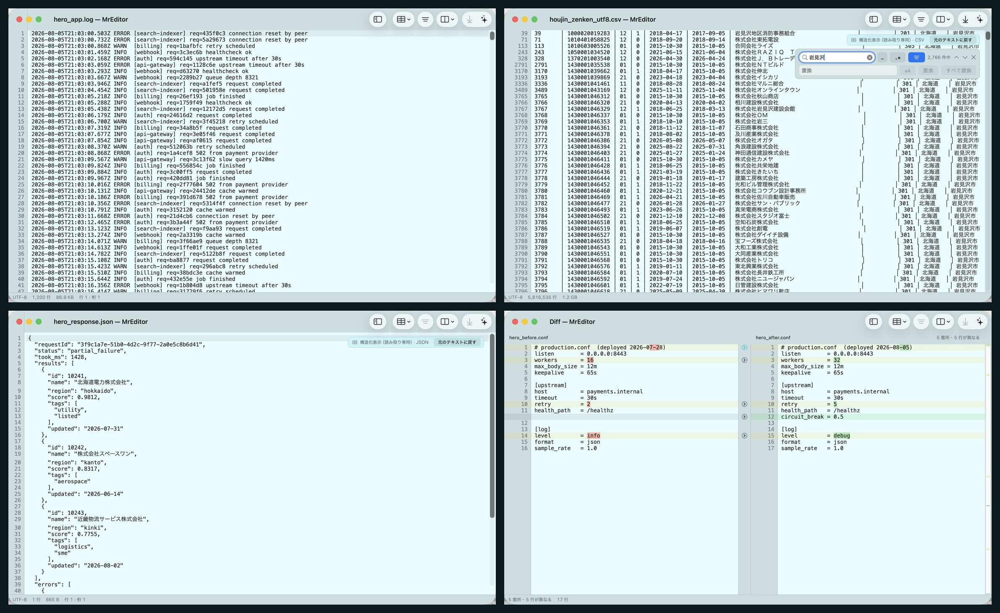
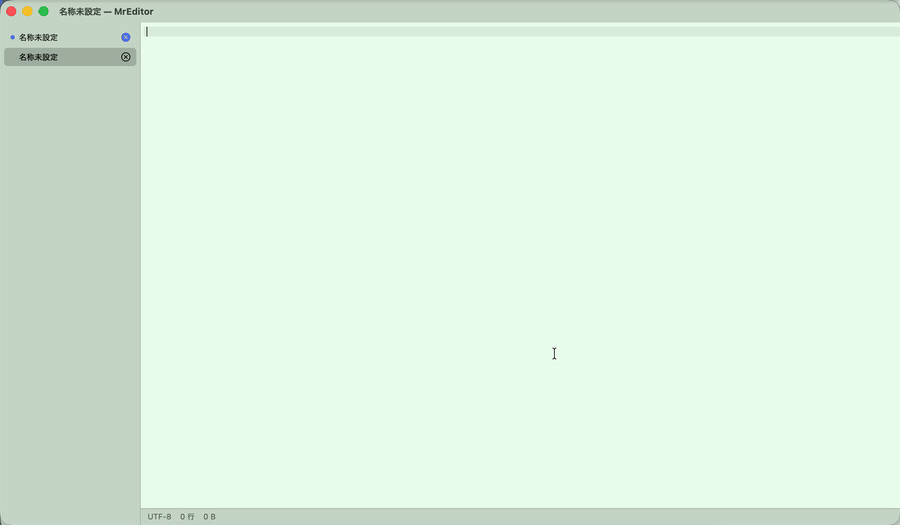
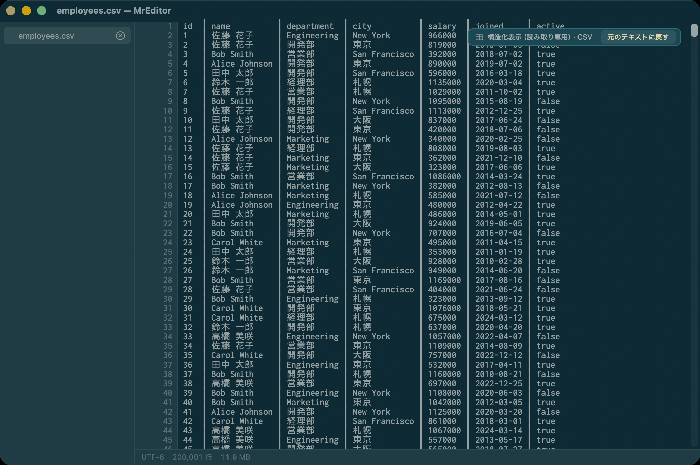
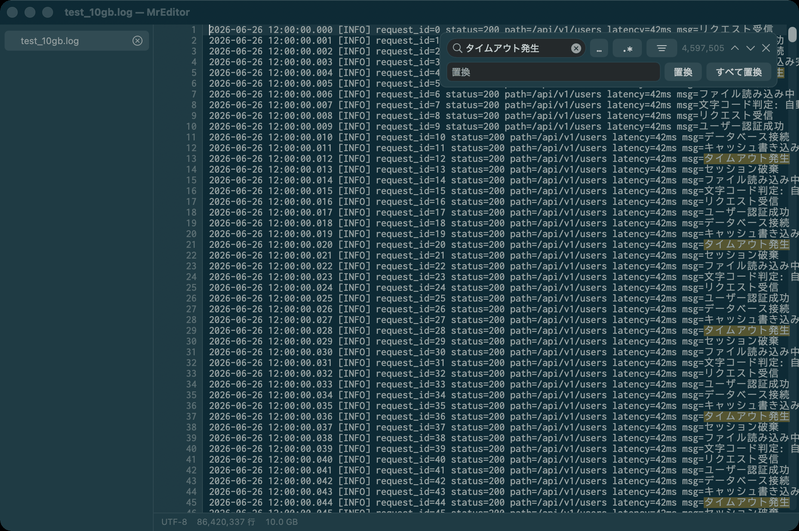

# MrEditor

**English** | [日本語](README.ja.md)

**The Mac editor for text you didn't write.**

Logs. CSVs. Exports, dumps, diffs. Text that arrived from somewhere else — so you don't get to
choose its size, its encoding, or how badly it is formatted. MrEditor opens it, filters it, lines
up its columns, compares it, fixes it, and saves it without ever leaving the file half-written.

That is also why there is no autocomplete and no LSP here: this is not for writing code, it is for
**finding out what happened and correcting it**.

Japan's full corporate registry as CSV — **1.18 GiB, 5,816,535 rows** — opens in **51 ms** using
**78 MB**. Excel opens the same file and stops at **1,048,576 rows**, its hard limit, taking about
60 seconds and 2.24 GB to silently lose 4,767,959 rows. (Measured 2026-08-03 on the shipping 1.10.2
build; Numbers never opened it at all.)

Size is not the trick, it is the floor: a **10 GB, 86,420,337-line** log starts displaying in
**~80 ms**, `vmmap` reports **0 bytes dirty** for it, and jumping to the last line takes **0.1 ms**.
Nothing about the app changes as the file grows.

> It started life as a fast **read-only** viewer (full-file search, filtered view / live grep,
> `tail -f`). **v0.4 makes the name literal**: it edits and saves too.

And it can **`tail -f` a growing 10 GB log (⌥⌘F) while you edit it in place** — without reloading.
The mmap index extends by the new bytes only, so it holds up even while the file is still being
written at 10 GB. Editors that tail (BBEdit, Sakura) reload the whole file; log viewers that scale
to 10 GB (klogg, lnav) are read-only. **Following a multi-GB log incrementally while staying
editable — we couldn't find that combination anywhere else.**



*Left to right, top to bottom: a service log; a 5,816,535-row CSV filtered while its columns stay lined up; a minified JSON response pretty-printed; two config files compared down to the character that changed. None of it was written by the person looking at it.*



*The first 10 seconds of a single uncut take, at real speed: the 10.00 GB file opens, and we scroll it while the line index is still building. Watch the status bar — the line count is an estimate until the index lands (9.1 s), then it settles at the exact **86,420,337**. The view never blocks; you can read, search and edit throughout. [The whole 27-second take, uncut, ending with ⌘L to the last line.](docs/media/mreditor-10gb.mp4)*

<p align="center">
  
  
</p>

## Why

The usual answer on macOS is `NSTextView`, but it keeps the whole document in
`NSTextStorage`. Hand it 10 GB and it falls over. MrEditor takes the large-log-viewer
approach (klogg / glogg / lnav):

- **mmap** the file — never load the whole thing into memory.
- Keep a **sparse line index** (line number + byte offset every 2,000 lines → 670 KB for this file, ~800 KB for 100 M lines).
- **Draw only the visible lines** with Core Text, on a fixed-size view driven by a custom
  line-unit `NSScroller` (so we never build a 1.6-billion-point document view that would
  blow past float precision).

See [docs/ARCHITECTURE_v0.1.md](docs/ARCHITECTURE_v0.1.md) for the full design.

## Features

<!-- 版数はここに書かない。9 リリースぶん「(1.2)」のまま放置して嘘になった。
     どの版で入ったかは各項目と下のロードマップが持つ。 -->

**Toolbar** — the six defaults are this app saying what it is
- **Structured View, Filter, Compare, Follow (`tail -f`), AI diagnosis**, plus a sidebar toggle.
  Everything here used to live in menus and shortcuts, which means it did not exist for anyone
  who just launched the app.
- Search, save, go-to-line and font size are deliberately **not** in the defaults — ⌘F and ⌘S are
  already known to everyone, and adding them makes the window look like every other editor.
  They are all in *Customize Toolbar…*, along with everything else.
- In a narrow window items fold into » from the right, so **AI diagnosis disappears first and
  Structured View survives longest** — the order is the priority.

**Viewing**
- Opens arbitrarily large text files (validated at 10 GB) with near-instant first paint.
- Automatic encoding detection: **UTF-8 / Shift-JIS / EUC-JP** (verified on real files).
- Custom line-unit scroller and keyboard navigation (arrows, page, home/end).
- **Go to line (⌘L)** and **adjustable font size (⌘+ / ⌘- / ⌘0)** — persisted across launches.
- **Follow mode (`tail -f`, ⌥⌘F)** — auto-scrolls as the file grows. It **extends the index
  incrementally instead of reloading**, so it holds up on a 10 GB log that's still being written
  (following pauses while you have unsaved edits, and resumes on save).
- Copy the visible range (⌘C). Status bar: encoding, line count, file size, indexing progress.

**Editing (new in v0.4)**
- **Edit and save files of any size** — small files load into an `NSTextView`; large files edit
  through a **piece table** over the mmap, so even a huge log stays responsive while you type.
- **Atomic save** — writes to a temporary file and swaps it in, so the original is never left half-written.
- **Choose the save encoding** — convert between **UTF-8 / Shift-JIS / EUC-JP**; line endings are
  normalized to the file's own EOL (LF / CRLF).
- New (⌘N), Save (⌘S), Save As (⌘⇧S), and Revert to saved.

**Workspace**
- Open **multiple files at once** and switch between them from a **sidebar** list.
- **Close from the sidebar** — each row has a close (×) button; **unsaved documents are color-coded**.
- **Session restore (new in v0.7)** — your sidebar comes back on launch (order and active tab
  included; files that vanished are skipped). **Unsaved new documents are restored with their text**,
  so quitting never nags you to save a scratch tab (unsaved edits to *saved* files are still confirmed).
- **Recent files** (File ▸ Open Recent).
- Drag a file onto the window to open it.
- **Finder integration (new in v0.8)** — MrEditor appears in Finder's *Open With* for `.log`,
  `.txt`, `.csv`, `.json` and friends. It never steals the default app.
- **Print & PDF export (new in v0.8)** — File ▸ Print… (⌘P). The print dialog's
  *PDF ▸ Save as PDF* gives you a PDF. Disabled for huge files (millions of pages).
- **Update check (new in v0.8)** — tells you when a newer version ships (on launch, once a day).
  It never replaces anything; it just opens the download page. Turn it off in Preferences ▸ General.

**Customization (new in v0.5)**
- **Fonts** — pick any monospaced family and size (Preferences ▸ Display), persisted across launches.
- **Display** — tab width (2/4/8), line spacing, current-line highlight, caret shape (bar / block / underline), and soft-wrap.
- **Color themes** — System (auto light/dark), Solarized Dark / Light, Monokai, Dracula, Nord, Grass, Red Sands, or fully custom colors — applied to
  the text **and** the surrounding UI (sidebar, gutter, status bar, title bar).
- **Background opacity** — make the whole window translucent so the desktop shows through (iTerm-style; Preferences ▸ Colors).
- **ANSI colors** — colorize ANSI escapes (`ESC[…m`) in logs while viewing (the escape sequences are stripped automatically).

**Search** (⌘F) — streams over the mmap, never loads the file
- Instant highlight of matches in the visible lines, plus a background full-file scan
  with an exact match count (capped at 1,000,000 matching lines).
- **Multi-term AND** (space-separated), **regular expressions** (`.*` toggle — including **lookahead / lookbehind** assertions), and a **case-sensitive** toggle.
- Find next / previous, jumping to each matching line.
- **Filtered view / live grep** — show only matching lines, keeping their real line numbers.
  **At any size, since 1.11**: it used to be large-file-only, so it was greyed out on the ordinary
  few-KB files you actually edit. Filtering is read-only, and saving while filtered still writes
  the whole file, not the rows you can see.
- **Works with Structured View on (since 1.11)** — filter a CSV down to the matching rows and the
  columns stay lined up. Replace is the one thing refused while formatting is on: rewriting through
  a padded view would change something other than what you are looking at.
- **In the editing pane too (fixed in 1.10.1)** — files under 8 MB open in the editing pane, where ⌘F
  searches and replaces as well: every match highlighted, ⌘G / ⇧⌘G to step through (wrapping at the end),
  Replace and Replace All (one undo), and case-preserving replace.

**Compare / diff (new in v1.1)** — View ▸ Compare (Diff)
- Four ways in: **two files** (⇧⌘D), **two open documents** (unsaved text included — it compares what you see), **against the clipboard**, or **against a URL** (https — paste a link and it diffs what the web returns against what you have open).
- Side by side, with additions, deletions and changes colored. **Changed lines get a character-level diff**, so a single `status=200` → `500` stands out.
- **⇧⌘] / ⇧⌘[** for next / previous difference. The **scrollbar shows where the differences are**, so you can see at a glance which parts of a million-line file moved.
- Select within a column and **⌘C** to copy (rows that exist only on the other side are never mixed in).
- **Merge (new in v1.2)** — **click the → beside a difference** and the left side's version lands in the right, immediately (click again to undo; ⌥→ / ⌥← also work).
  The arrow means what it says: **the right side is what changes**. Write that result out with **View ▸ Compare (Diff) ▸ Save Merged Result As…**.
  **The two original files are never touched.** Push nothing across, and you get the right file back byte for byte.
- **Compare Formats (new in v1.12.3)** — View ▸ Compare (Diff) ▸ **Compare Formats** (⇧⌘F).
  For data pulled from a test environment and from production, where **the values differ by definition and
  the only question is whether the shapes match**. Digits collapse one for one and runs of letters collapse to one,
  so **rows that differ only in their values read as identical**, while `2026-08-19` vs `2026/08/19`,
  `007` vs `7` and `１２３` vs `123` **stay differences**. Kana and kanji collapse as values too, but
  **full-width punctuation and the ideographic space stay part of the shape**. It works from all four ways in,
  and **merging is locked while it is on** — same shape means different contents, so pushing one across would erase them.
- Diffing needs a 16-byte index per line — unlike viewing, that is real memory. Files too large for
  your machine are **refused with a reason**, never silently killed. Measured: 1 GB × 2 (8.7 M lines) in 5.4 s, 1.7 GB.

**Structured view (new in v0.6)** — read-only, toggled from View ▸ Structured View
- **CSV / TSV** aligned into monospaced columns; **NDJSON** projected into columns by key.
- **JSON** pretty-printed with indentation (new in 1.4) — key order and number formatting preserved,
  since it re-indents the original text rather than re-serializing.
- Column widths are fixed from a sample of the file, so **millions of rows format instantly** and
  don't jitter while scrolling. **East-Asian-width aware** — full-width Japanese columns line up.
- **You can still grep it while it's on** — search, filtered view (live grep) and `tail -f` all keep
  working with the columns lined up, so you can narrow 5.8 million rows down to the matching ones
  and still read them as a table. Replace is the one thing that's refused while formatting is on:
  rewriting through a padded view would change something other than what you're looking at.
- **Fixed-width (new in 1.12)** — data with no delimiter at all is read through the column guides you
  placed below: **each boundary is a column**. Column names are the columns themselves (`1-8`). It is the
  one mode that cannot be detected from the contents, so if there is no definition yet it asks for one.
- **Pinned column names and draggable widths (new in 1.12.1)** — the column names stay pinned above the
  text, so three million rows down you can still tell what a column is. **Drag a boundary in that strip to
  resize the column**: only a guide line follows the mouse, and the text is rebuilt when you let go, so it
  stays responsive on huge files.
- Purely a display transform: it never modifies the file (saving keeps the original CSV/JSON), and a
  banner with a **Back to raw text** button is shown while it's on.

**Column ruler and fixed-width fields (new in 1.12)** — View ▸ Column Ruler (⌥⌘K)
- The tool for answering "which column does this field start at, and how wide is it" in fixed-width
  data. Delimited formats are handled by the structured view; **fixed-width records are not.**
- A ruler appears above the text, and **clicking a tick drops a vertical line** at that column (a column
  guide). **Guides can be dragged**, so nudging one by a single column doesn't mean deleting and replacing it.
- If you have the record layout, type it: **View ▸ Column Fields… (⇧⌥⌘K)** takes `1-8,9-14,15-40`
  (full-width digits, commas and dashes are accepted too, since specs get pasted that way). A definition
  that can't be read is never half-applied — the sheet comes back until it parses.
- **Definitions are remembered per file.** Reopen the file and it comes back with the same fields and ruler.
- Feed it straight into **Structured View ▸ Fixed-width** (above). Columns are counted in **display width**
  (full-width characters take two), not in characters. Wrapping is turned off while the ruler is up, since a
  wrapped line splits and the columns stop meaning anything.

**Lining text up by column (new in 1.12.2)** — draw a guide and the text becomes columns
- Every other field is tinted, so the record reads as a table straight away. **No reformatting happens, so it
  never becomes read-only** — fixed-width data is already aligned, so tinting is all it takes.
- **Tab** pads to the next field's column (text after the caret shifts there). **⇧Tab** takes the padding back
  (only spaces are removed, never your characters). **A tab character is never inserted** — one tab in a
  fixed-width file breaks every column the moment another tool reads it.
- **⌥Tab** applies the same layout to every remaining line. **With no guides yet it derives one from the
  content** (each field as wide as its longest value, same idea as `column -t`), so ⌥Tab works as the very
  first thing you press.
- **Drag a guide and the text follows** (re-aligned when you let go; ⌘Z if you didn't want it).
- **Every entry point stands on its own**: type then Tab / just press ⌥Tab / click the ruler / type
  `1-8,9-14,15-40` with ⇧⌥⌘K. Anything that touches columns brings the ruler up, so ⌥⌘K first is not required.

**JSON query (new in 1.4)** — View ▸ JSON Query… (⌥⌘J), on a JSON document
- Type a **jmespath-style expression** and the view is replaced by the result, live: fields and dotted
  paths (`a.b.c`), array indexes (`items[0]`, `items[-1]`), wildcard projection (`items[*].name`,
  `m.*`), and filters (`items[?age >= 30].name`, comparators `== != < <= > >=`).
- **Volatile and read-only**: the result is never saved; close the bar (Esc) to return to the original.
  Best for config and API-response JSON (small files); large logs use NDJSON above.

**Text toolbox (new in 1.5)** — the **Format** menu, acting on the current selection (one undo each)
- **Case**: UPPER / lower / Title Case / tOGGLE cASE.
- **Encode / decode**: URL, Base64, and HTML entities (decoders leave invalid input untouched).
- **Line ops**: sort (ascending / descending), remove duplicate lines (keeps first-seen order),
  reverse, number lines, and **join / indent / outdent (added in 1.7.1)**.
- **Filter Through Command… (⌥⌘R)**: pipe the selection through any shell command — `jq .`,
  `sort`, `sed 's/a/b/g'` — and replace it with the output. Runs off the main thread with a timeout.
- Works in **both panes**, so line ops and filters run on a selection inside a 10 GB file too.

**Appearance & sharing (new in 1.6)** — Preferences ▸ Colors
- **Preset themes**: System, Solarized Dark/Light, Monokai, **Dracula, Nord, Grass, Red Sands** —
  the body colors and the surrounding chrome (sidebar, gutter, status bar) move together.
- **Share your look**: export the whole appearance (theme, colors, font, layout) to a
  `.mreditortheme` file, or **Copy Link** — a self-contained `mreditor://` link that anyone with
  MrEditor can open to apply it in one click. Applying always asks first. No account, no server.

UI **localized in English and Japanese**.

## Install

Download `MrEditor-<version>.dmg` from [Releases](../../releases), open it, and drag
**MrEditor** to Applications.

**Runs on both Apple Silicon and Intel** (universal build).

**As of v0.9 the app is signed with an Apple Developer ID and notarized by Apple.**
No right-click, no `xattr` — just double-click it.

Or just build from source (below).

## Build & run

Requires macOS 13+ and a Swift toolchain (Xcode 15+).

```sh
swift build
sh scripts/make_app.sh debug          # wrap the binary into MrEditor.app
open .build/MrEditor.app --args "/path/to/big.log"
```

Generate test data (the `testdata/` dir is git-ignored):

```sh
python3 scripts/gen_testdata.py --encoding-set --out-dir testdata/   # UTF-8 / SJIS / EUC samples
python3 scripts/gen_testdata.py --size 10G --jp --out testdata/test_10gb.log
```

Build a distributable disk image (`.build/MrEditor-1.12.3.dmg`):

```sh
sh scripts/make_dmg.sh
```

## Performance (measured 2026-07-15, 10.00 GB / 86,420,337 lines, Japanese UTF-8)

Re-measured 2026-07-19 on the shipping 1.7 build (`swift build -c release`), Apple Silicon.

| Metric | Result |
|---|---|
| Time to first paint | 45–80 ms (varies run to run) |
| Full background index | ~10 s (does not block display) |
| Seek to last line | 0.1 ms |
| The file's own pages | 3–6 GB resident (varies run to run), **0 bytes dirty** |
| App physical footprint | ~145 MB — about the same with nothing open (~143 MB empty) |

The last two rows are the honest picture, so read them together. The 10 GB you opened costs
nothing: it is mapped, not copied, and `vmmap` attributes **0 dirty bytes** to it — the resident
pages are file-backed and the OS can drop them whenever it likes. The app's own ~145 MB is window
backing store and the kernel page tables for a 10 GB mapping; it barely moves whether the file is
open or not, and none of it is your log. `ps` RSS reads several GB during indexing for the same
reason, and means just as little.

Reproduce it yourself:

```sh
MREDITOR_TIMING=1 .build/MrEditor.app/Contents/MacOS/MrEditor testdata/test_10gb.log
# → first paint: 61.2 ms
# → index complete: 10.24 s (86420337 lines)

vmmap $(pgrep -x MrEditor) | grep test_10gb.log     # → 10.0G  2.8G  0K  (vsize resident dirty; resident varies, dirty stays 0)
```

## Roadmap

- **v0.1 — viewer** ✅
- **v0.2 — search, multi-term AND, regex, filtered view (live grep), `tail -f`, copy** ✅
- **v0.3 — multiple documents + sidebar, go to line, font zoom, recent files, case-sensitive search** ✅
- **v0.4 — editing & saving (any size), atomic writes, encoding conversion, EOL handling, new/save/save-as/revert** ✅
- **v0.5 — customization: font selection, display settings, color themes (editor + UI), sidebar close & unsaved markers** ✅
- **v0.6 — structured view: CSV/TSV column alignment & NDJSON field projection (read-only, any size)** ✅
- **v0.7 — session restore (unsaved drafts included), About panel fix** ✅
- **v0.8 — Finder integration, print/PDF export, update check, new icon, universal build, and a critical distribution fix (below)** ✅
- **v0.9 — signed with an Apple Developer ID and notarized by Apple; opens with a plain double-click** ✅
- **1.0 — the milestone: open and edit 10 GB files on a Mac, signed and notarized, opens with a double-click** ✅
- **1.0.1 — fixes data loss: an unsaved new document vanished when the app was launched by opening a file** ✅
- **1.0.2 — unsaved text is kept as its own draft file, written as you type: it survives a crash or force quit** ✅
- **1.0.3 — Go to line (⌘L) no longer fails silently when a Japanese IME is active** ✅
- **1.1 — Compare (diff): two files, two open documents, or against the clipboard — side by side, down to the characters that changed** ✅
- **1.1.1 — Compare Two Files now asks for one file, then the other. Before, it silently did nothing unless you ⌘-clicked both at once** ✅
- **1.2 — Merge: click the arrow next to a difference to pull it across, then save the result under a new name. The two originals are never touched** ✅
- **1.2.1 — Merge now follows the arrow: → pushes the left side into the right, and the right pane changes as you click. Before, it only remembered your choice and nothing moved on screen** ✅
- **1.3 — Compare with a URL (https): paste a link and it diffs what the web returns against the document you have open — a fourth way in, alongside two files, two open documents and the clipboard** ✅
- **1.4 — JSON: pretty-print a document from Structured View, and query it in place with a jmespath-style expression (⌥⌘J) — filter and project without touching the file** ✅
- **1.5 — Text toolbox (Format menu): case conversion, URL/Base64/HTML encode-decode, sort/dedupe/reverse/number lines, and Filter Through Command (⌥⌘R) to pipe a selection through any shell command — in both panes, so it works inside a 10 GB file too** ✅
- **1.6 — Appearance & sharing: preset themes (Dracula, Nord, Grass, Red Sands, …), plus export/import of your whole look and a self-contained `mreditor://` share link that applies it in one click** ✅
- **1.7 — Regex lookahead/lookbehind in search & replace, ANSI colors in logs (escape sequences colorized while viewing, stripped from the text), and window-wide background opacity (iTerm-style translucency)** ✅
- **1.7.1 — Join / Indent / Outdent added to the text toolbox (Format ▸ line ops, both panes)** ✅
- **1.8 — Line-number gutter and invisible-character display, caret line:column in the status bar; multi-cursor editing in the edit pane (⌘-click / ⌥⌘↑↓ / ⌘D), Split Lines and parameterized line numbering, and case-preserving replace (aA)** ✅
- **1.9 — AI error diagnosis, bring your own key: select a stack trace, press ⌥⌘E, and a floating panel explains what went wrong, the likely cause, and one next step (Anthropic / OpenAI / Gemini; the key stays in your Keychain)** ✅
- **1.10 — The answer streams in as it is written, instead of appearing all at once after the wait; the model is a dropdown you can also type into, and a Test Connection button proves the key, model ID and endpoint before you need them — a model that is not in the list can be typed in, and once it passes the test it joins the list. Failures now say what happened in your own language, with the provider's original text kept underneath** ✅
- **1.10.1 — ⌘F now works on ordinary files. Search and replace had only ever been built for the read-only large-file pane, so on anything under 8 MB — the files you actually edit — ⌘F just beeped and the menu item was greyed out. Go to Line (⌘L) was dead in that pane too, and Undo was shared across every document in the window** ✅
- **1.10.2 — OpenAI reasoning models (o4-mini, o3) were rejected outright: the request sent `max_tokens`, which those models refuse with a 400. Now it sends `max_completion_tokens`. The connection test also gave itself more room, because that limit covers reasoning *plus* the answer — a correct key could fail with an empty reply. And "the answer came back empty" now says so in your own language instead of English. Anthropic and OpenAI streaming are both verified against the real APIs now — the gap noted in 1.9 and 1.10 is closed** ✅
- **1.10.3 — Two things that only showed up on a 1.18 GiB CSV of every registered company in Japan (5,816,535 rows). The menu bar read "File · Edit · Format · View" in a Japanese UI, because those two menus were the only ones not going through the localisation table. And in Structured View the column widths were measured from the first 1000 rows alone, so a column that grew later got truncated — the row-number column showed `581…` near the end of that file. Widths are now sampled from both ends** ✅
- **1.11 — A toolbar, and the two places it exposed. Everything this app is for lived in menus and shortcuts, which means it did not exist for anyone who just launched it: the six defaults (sidebar, Structured View, Filter, Compare, Follow, AI diagnosis) are now the app saying what it is. Putting them on screen made two gaps visible, so both are closed. Filtered view (live grep) was large-file-only, so it was greyed out on the ordinary files you actually edit. And turning on Structured View killed search, filter and `tail -f` — the one operation you most want on a CSV was unavailable exactly when the CSV was readable. **You can now grep with the columns still lined up**, at any size** ✅
- **1.11.1 — The Structured View banner sat on top of the search bar, hiding the filter button, the match count and next/previous. Reported within hours of 1.11, and it was 1.11's own doing: making search work during Structured View meant both could be on screen at once for the first time, and I never moved either of them. Search was running the whole time — you just couldn't see it. The bar now sits below the banner, and the matching row is banded while formatting is on, so typing a query does something visible** ✅
- **1.11.2 — Fix it in another app and this one kept showing you the old bytes. Edit the file elsewhere, run `sed` over it, switch branches — the file changed and the open window said nothing. Open files are now watched: with no unsaved changes the new contents load in place, keeping your caret and scroll position. With unsaved changes nothing is overwritten — a banner says the file changed and lets you decide. A large file that only grew extends its index instead of being reopened, so a 10 GB log does not pay 8 seconds per append. It also closes a hole where text appended by another process vanished the moment you started editing (Follow mode had it too)** ✅
- **1.12 — Fixed-width data became countable. Delimited files open into columns in the structured view, but a fixed-width record got nothing: counting columns meant dragging a finger across the screen. A column ruler now sits above the text (⌥⌘K); click a tick to drop a line on a field boundary, and drag it to adjust. If you have the record layout, type it instead: `1-8,9-14,15-40` (⇧⌥⌘K). The definition is **remembered per file**, so reopening brings it back. Feed it into the structured view's **Fixed-width** mode and the records read as aligned columns, named by the columns themselves (`1-8`). Columns are counted in display width, so a line containing full-width characters keeps its guides where they belong** ✅
- **1.12.1 — Floating panels can be dragged, and the structured view got pinned column names. The search bar and the structured banner both float in the same top-right corner; 1.11.1 papered over it by pushing the search bar down, but adding one dodge per pair breaks as soon as there are more of them. Now you grab a panel and put it where you want, and it is remembered (View ▸ Reset Floating Panel Positions puts them back). The other half is the structured view: the columns lined up, but three million rows down you could no longer tell what a column was. **Column names are now pinned above the text**, and dragging a boundary in that strip **resizes the column** — a guide line follows the mouse and the text is rebuilt on release, so 400,000 rows stay responsive** ✅
- **1.12.2 — Drawing a guide changed nothing about the text, and reading it as columns meant three levels of menu. It ended at "I drew a line — so what?". **Fixed-width data is already aligned**, so tinting every other field turns it into a table with no reformatting at all — and without going read-only. On top of that, **Tab pads to the next field's column** and **⌥Tab applies the layout to every remaining line**. With no guides yet, ⌥Tab derives the layout from the content, so it works as the first thing you press. Drag a guide and the text follows. The tool no longer requires knowing the order of steps** ✅
- **1.12.3 — Put data from a test environment beside data from production and the values differ by definition; the only question is whether the date formats match. Diff called every line different and left nothing readable. Added **Compare Formats** (⇧⌘F), which collapses values and compares only the shape: rows that differ only in their values read as identical, while `2026-08-19` and `2026/08/19`, or `007` and `7`, stay differences. Merging is locked while it is on — same shape means different contents. Measured: on a 200,000-line CSV, the same rows with every value replaced compare as identical in 0.14 s. Also fixed something that had never worked: **menu check marks and greying out** (`validateMenuItem` was never called by AppKit). Which structured mode is on, and whether the column ruler is showing, are finally visible in the menu** ✅ (this release)
- **later** — syntax/log highlighting, and more analysis tooling

> **⚠️ Builds up to v0.7 do not launch on a Mac that downloaded them.**
> The `.app` bundle was never code-signed, so its signature seal was inconsistent and
> macOS killed the quarantined app on launch ("quit unexpectedly").
> **Fixed in v0.8.** The build is now **universal (Apple Silicon & Intel)** as well —
> previously it was arm64-only.
>
> **v0.8 launches, but needs a right-click → Open on the first run** (it is only ad-hoc signed).
> **v0.9 and later are signed and notarized, so even that is unnecessary.**

## MrkEditor (Pro) — in preparation

Everything in this repository stays **free and MIT**. What is being prepared separately is
**MrkEditor (Pro)**, and the line is: **reading one file is free; pulling an answer out of it
is Pro.**

| Feature | What it does | Measured (release, M4 Max/24GB, Aug 2026) |
|---|---|---|
| Count by value | per-value counts for a column or `key=value` (what `sort \| uniq -c \| sort -rn` does) | **3.40 s** over 10 GB / 86,420,337 lines |
| Column stats | every column of a CSV in one pass (type, blanks, distinct, min/max, sum/average) | **4.78 s** for 30 columns of 1.18 GiB / 5,816,534 data rows |
| Time histogram | when did it spike; lines without a timestamp are counted, not dropped | **3.18 s** over 10 GB / 67,156,671 lines |
| Search across folders | click a hit and the file opens at that line; Shift-JIS / EUC-JP detected per file | **3.14 s** for one literal over a single 10 GB log (on par with ripgrep) |

The free app has the same Analyze menu in the same place (never greyed out); choosing an item
shows one page explaining that feature. **It is not on sale yet** — there is no price and no
checkout.

## Not yet

Syntax / log highlighting and deeper analysis tooling. Editing landed in **v0.4** — the piece-table
design keeps even a 10 GB file editable without giving up the fast, low-memory open that MrEditor
is built around.

## Contributing

Bug fixes, performance, viewing/editing/search improvements, and translations are welcome — see
[CONTRIBUTING.md](CONTRIBUTING.md). The core is a fast viewer/editor for huge files; heavier
automation and analysis tooling are out of scope (it's open-core — fork freely).

## License

[MIT](LICENSE) © 2026 TABATA Hitoshi

---

🇯🇵 日本語の README は **[README.ja.md](README.ja.md)** にあります。
